# Backend-Aone Agent 后端架构文档

> 本文档描述 `backend-aone` 的完整技术架构，涵盖各层次模块职责、数据流、并发模型和用户隔离设计。

---

## 目录

1. [整体架构概览](#1-整体架构概览)
2. [第一层：API 接入层](#2-第一层api-接入层)
3. [第二层：并发网关层](#3-第二层并发网关层)
4. [第三层：Agent 核心层](#4-第三层agent-核心层)
5. [第四层：中间件层](#5-第四层中间件层)
6. [第五层：工具层](#6-第五层工具层)
7. [第六层：管理器层](#7-第六层管理器层)
8. [第七层：存储与沙箱层](#8-第七层存储与沙箱层)
9. [第八层：模型配置层](#9-第八层模型配置层)
10. [用户数据隔离设计](#10-用户数据隔离设计)
11. [核心请求流程](#11-核心请求流程)

---

## 1. 整体架构概览

```
┌─────────────────────────────────────────────────────────────────────┐
│                          前端 / 客户端                                │
│                    (React + Ant Design X)                            │
└──────────────────────────────┬──────────────────────────────────────┘
                               │ HTTP / SSE
┌──────────────────────────────▼──────────────────────────────────────┐
│                     第一层：API 接入层                                │
│              FastAPI  server.py / events.py / sse_handler.py        │
└──────────────────────────────┬──────────────────────────────────────┘
                               │
┌──────────────────────────────▼──────────────────────────────────────┐
│                     第二层：并发网关层                                │
│         Gateway / CommandQueue / TaskScheduler / ActivityMonitor    │
└──────────────────────────────┬──────────────────────────────────────┘
                               │
┌──────────────────────────────▼──────────────────────────────────────┐
│                     第三层：Agent 核心层                              │
│          TaskClawAgent / AgentStream / Prompt / AgentState          │
└────────┬──────────────────────────────────────────────┬────────────┘
         │                                              │
┌────────▼────────┐                          ┌──────────▼──────────┐
│  第四层：中间件  │                          │   第五层：工具层     │
│  UserData       │                          │  内置工具 + MCP工具  │
│  Memory         │                          │  + Skills            │
│  ToolError      │                          └─────────────────────┘
└─────────────────┘
         │
┌────────▼──────────────────────────────────────────────────────────┐
│                     第六层：管理器层                                │
│       ConfigManager / SessionManager / McpManager / SkillManager  │
└────────┬──────────────────────────────────────────────────────────┘
         │
┌────────▼──────────────────────────────────────────────────────────┐
│                   第七层：存储与沙箱层                               │
│         OSSStorage / CheckpointerManager / Sandbox(E2B/Daytona)   │
└────────┬──────────────────────────────────────────────────────────┘
         │
┌────────▼──────────────────────────────────────────────────────────┐
│                   第八层：模型配置层                                 │
│           LLMFactory / ActiveLLMConfig / LLMPreset                │
└───────────────────────────────────────────────────────────────────┘
```

---

## 2. 第一层：API 接入层

### 模块结构

```
server/
├── server.py       # FastAPI 主服务，路由定义，AgentManager
├── events.py       # SSE 事件类型常量定义
└── sse_handler.py  # Agent 流式事件 → SSE 格式转换
```

### 路由分组

```
GET  /                          健康检查

# 会话管理
POST   /api/session             创建新会话
GET    /api/sessions            获取会话列表
GET    /api/session/{id}        获取会话详情
DELETE /api/session/{id}        删除会话

# 核心任务（SSE 流式）
POST   /api/task                流式任务处理（主链路）
POST   /api/chat                非流式聊天（兼容旧接口）

# 模型管理
GET    /api/models/presets      获取所有预设模型
GET    /api/models/active       获取当前激活模型
POST   /api/models/switch       切换模型

# MCP 服务器管理
GET    /api/mcp/list            列出 MCP 服务器
POST   /api/mcp/add             添加 MCP 服务器
PUT    /api/mcp/update/{name}   更新 MCP 服务器
DELETE /api/mcp/delete/{name}   删除 MCP 服务器
POST   /api/mcp/reload          热更新 MCP 工具

# 技能管理
GET    /api/skills              列出技能
POST   /api/skills/create       创建技能
POST   /api/skills/upload       上传 zip/tgz 技能包
PUT    /api/skills/{name}       更新技能
DELETE /api/skills/delete/{name} 删除技能
POST   /api/skills/reload       热更新技能

# 网关 & 调度
GET    /api/gateway/stats       网关状态
GET    /api/gateway/tasks       调度任务列表
POST   /api/gateway/tasks       注册调度任务
DELETE /api/gateway/tasks/{name} 注销调度任务

# 文件 / OSS
GET    /api/files/url           获取文件访问 URL
POST   /api/files/sync          同步本地文件到 OSS
```

### SSE 事件类型

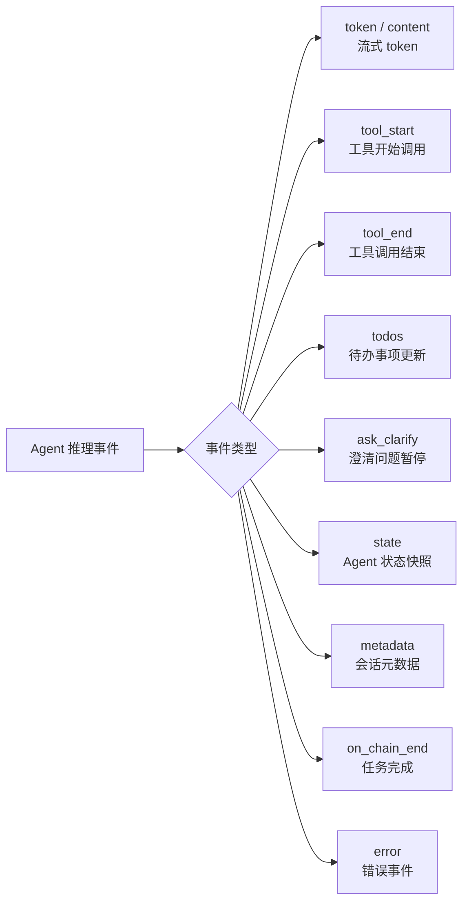

### AgentManager 设计

`AgentManager` 是 API 层的核心单例，负责多用户 Agent 实例的生命周期管理：

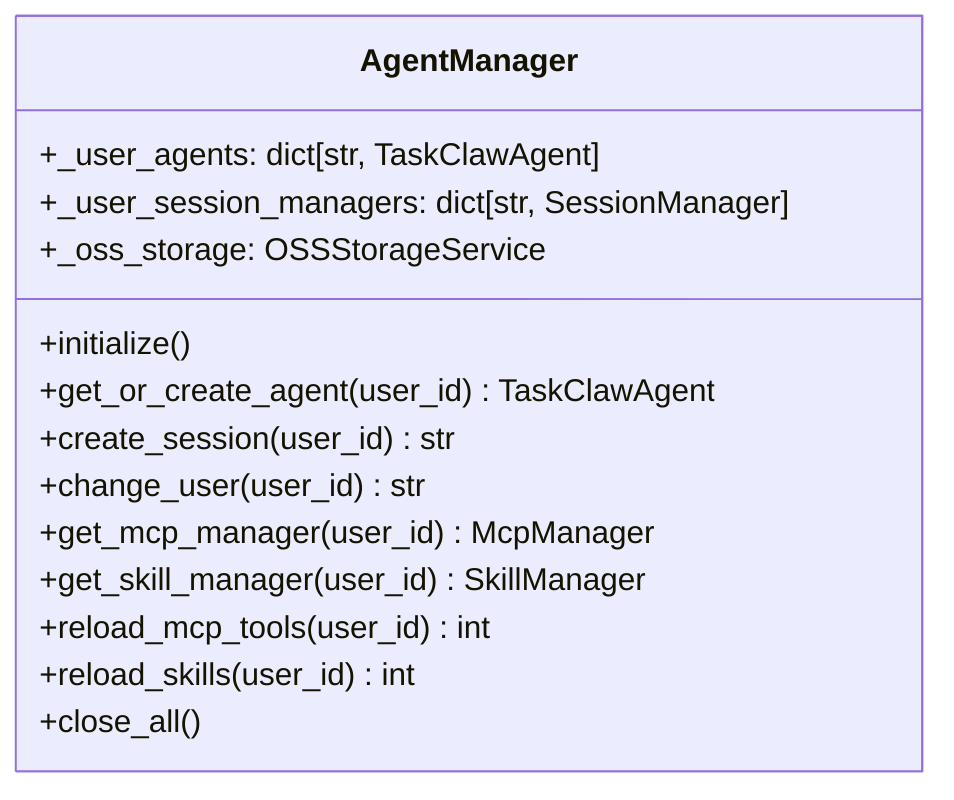

---

## 3. 第二层：并发网关层

### 模块结构

```
gateway/
├── gateway.py          # 核心网关，并发控制入口
├── command_queue.py    # 用户级命令队列（串行化同用户请求）
├── activity_monitor.py # 系统空闲状态监控
├── task_scheduler.py   # 定时/空闲触发的后台任务调度
├── schedule_loader.py  # 从 schedule.md 加载任务指令
└── handler_factory.py  # 注册预设 handler（stream / stream_collector）
```

### 并发控制模型

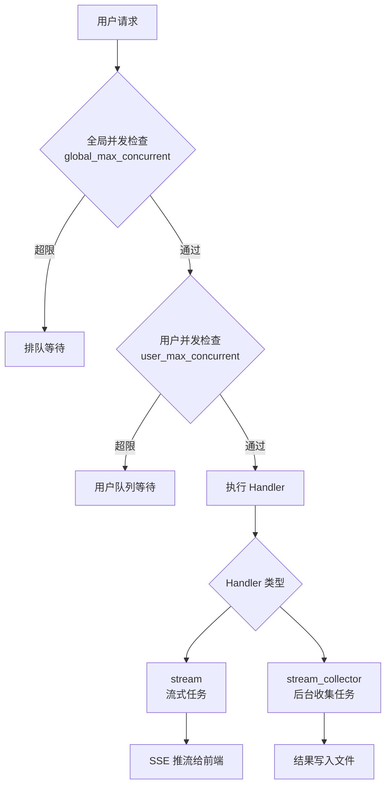

### 后台调度流程

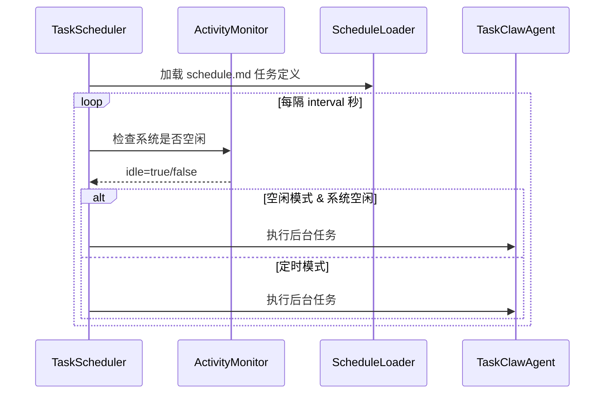

---

## 4. 第三层：Agent 核心层

### 模块结构

```
agents/
├── taskclaw_agent.py  # Agent 主体（生命周期、推理、工具、沙箱）
├── agent_stream.py    # 流式事件迭代器
└── prompt.py          # 系统 Prompt（任务工作流指令）
```

### TaskClawAgent 核心状态

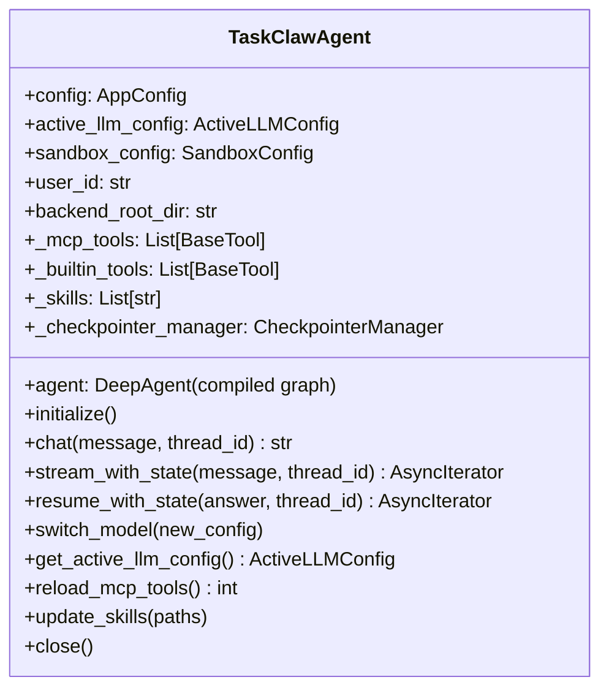

### Agent 初始化流程

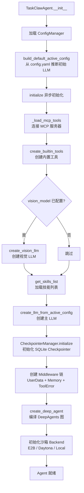

### 流式推理流程

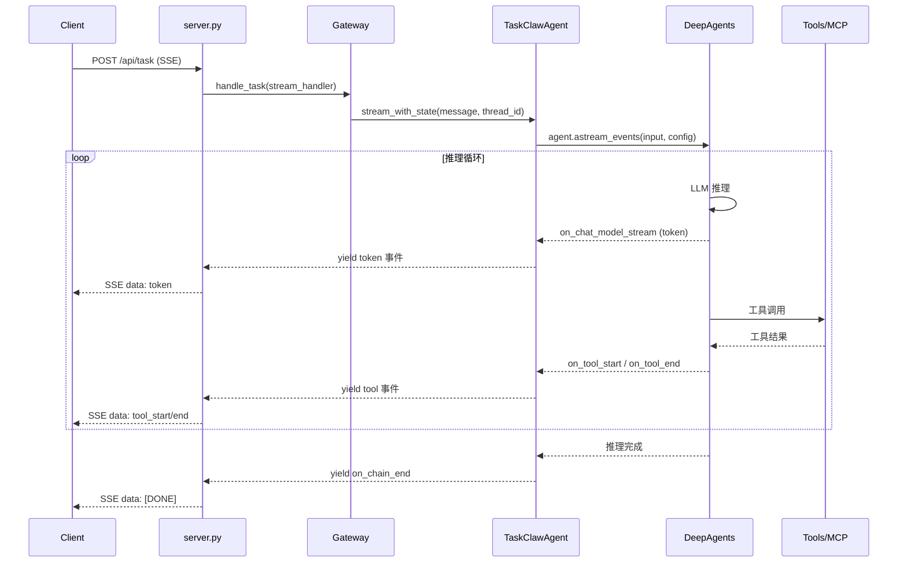

---

## 5. 第四层：中间件层

### 中间件执行顺序

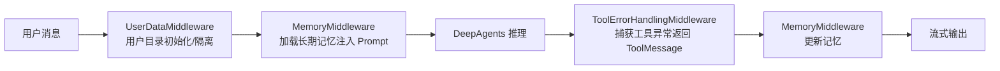

### 各中间件职责

| 中间件 | 触发时机 | 核心职责 |
|--------|----------|----------|
| `UserDataMiddleware` | 每次请求前 | 确保 `user-data/{user_id}/` 目录存在，初始化用户工作区 |
| `MemoryMiddleware` | 请求前/后 | 从 `memory/` 读取历史摘要注入系统 Prompt；推理后更新记忆 |
| `ToolErrorHandlingMiddleware` | 工具调用异常时 | 捕获异常，构造结构化 `ToolMessage` 返回，防止 Agent 崩溃 |

---

## 6. 第五层：工具层

### 工具分类

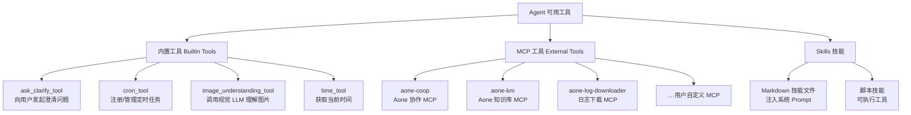

### MCP 连接协议支持

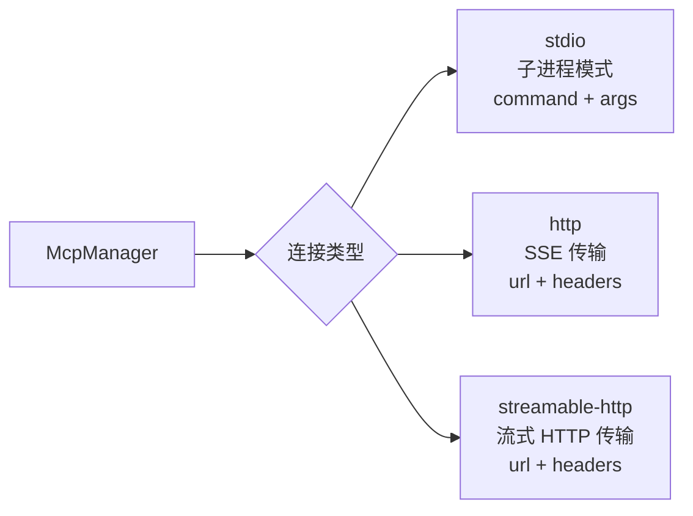

### ask_clarify 澄清流程

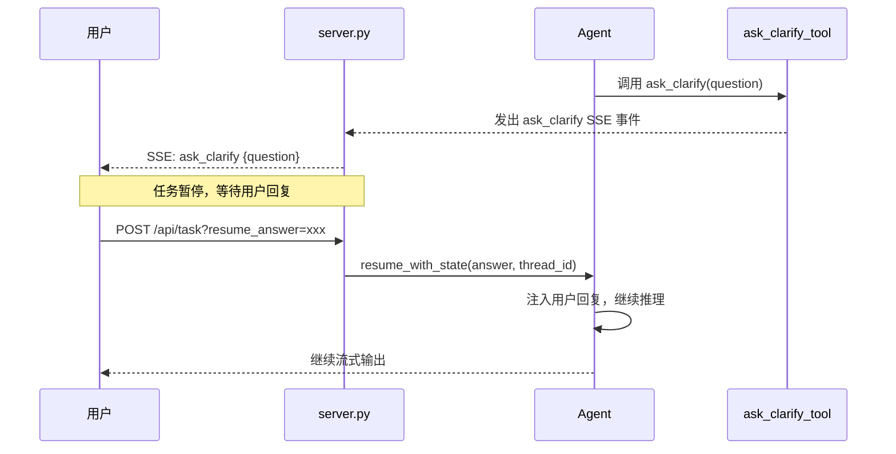

---

## 7. 第六层：管理器层

### 模块结构

```
managers/
├── config_manager.py   # 配置加载（全局/用户私有双层）
├── session_manager.py  # 会话元数据持久化（SQLite）
├── mcp_manager.py      # MCP 服务器配置 CRUD
└── skill_manager.py    # 技能文件管理（本地 + OSS）
```

### ConfigManager 配置加载优先级

```mermaid
flowchart TD
    A[ConfigManager.load] --> B{用户私有 config.yaml 存在?}
    B -->|是| C[加载用户私有 config.yaml]
    B -->|否| D[加载全局 config.yaml]
    C --> E{config.local.yaml 存在?}
    D --> E
    E -->|是| F[深度合并 local 配置]
    E -->|否| G[跳过]
    F --> H[解析 ${ENV_VAR} 环境变量]
    G --> H
    H --> I[Pydantic 校验]
    I --> J[返回 AppConfig]
```

### SessionManager 数据模型

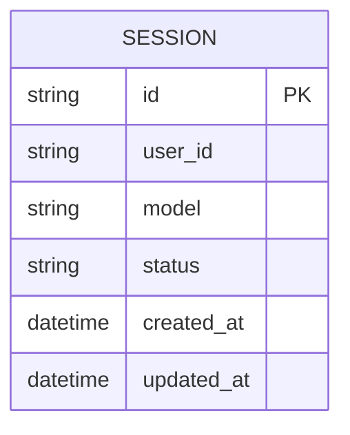

### SkillManager 技能同步流程

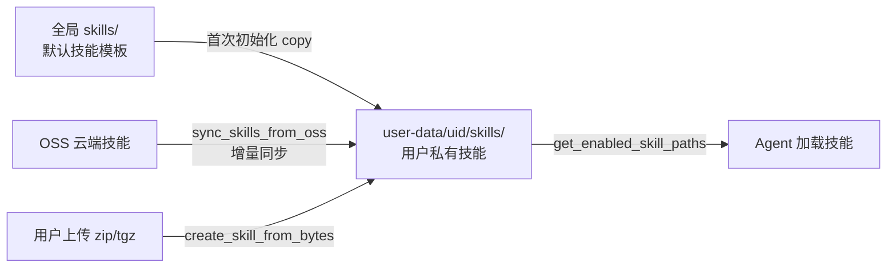

---

## 8. 第七层：存储与沙箱层

### 存储架构

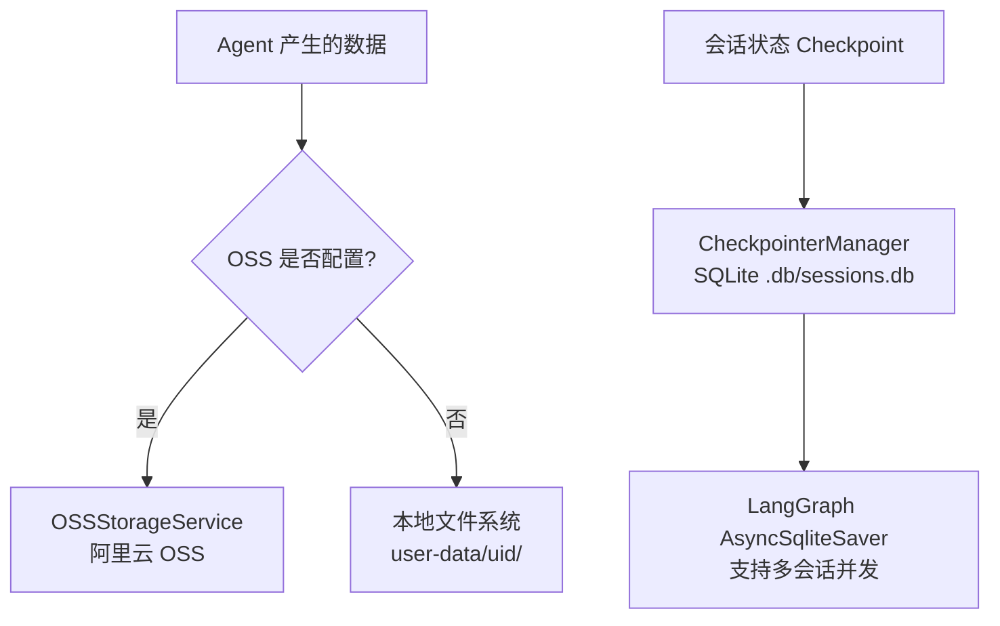

### 沙箱执行架构

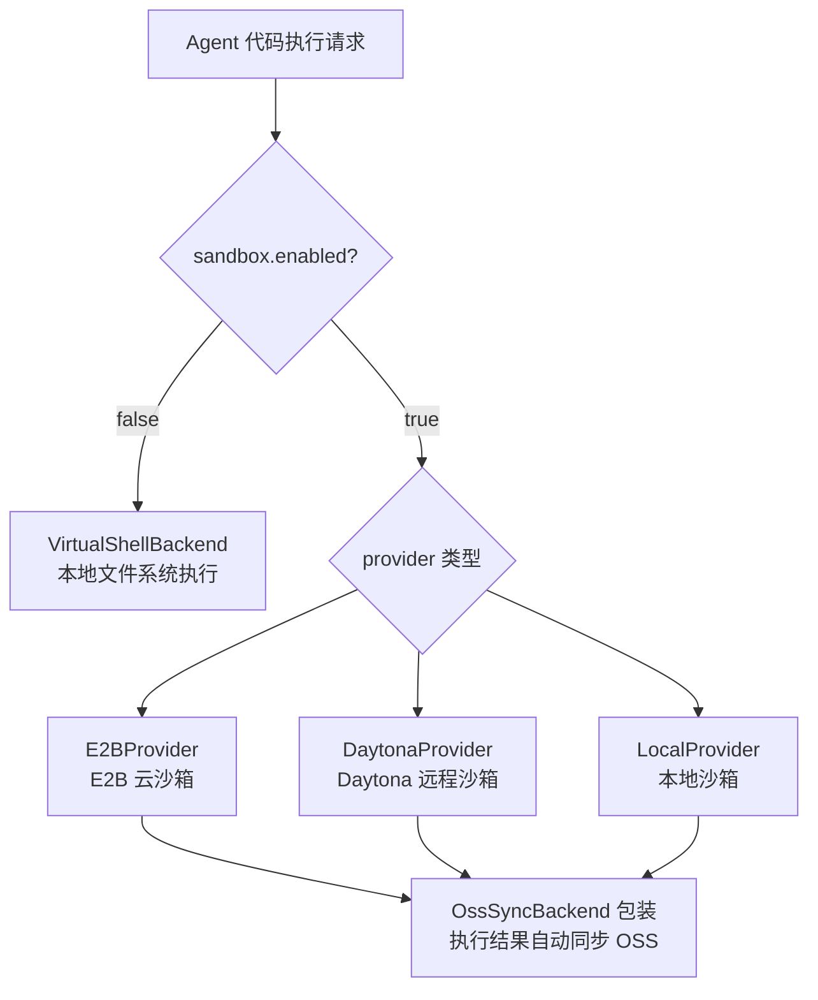

---

## 9. 第八层：模型配置层

### LLM 预设体系

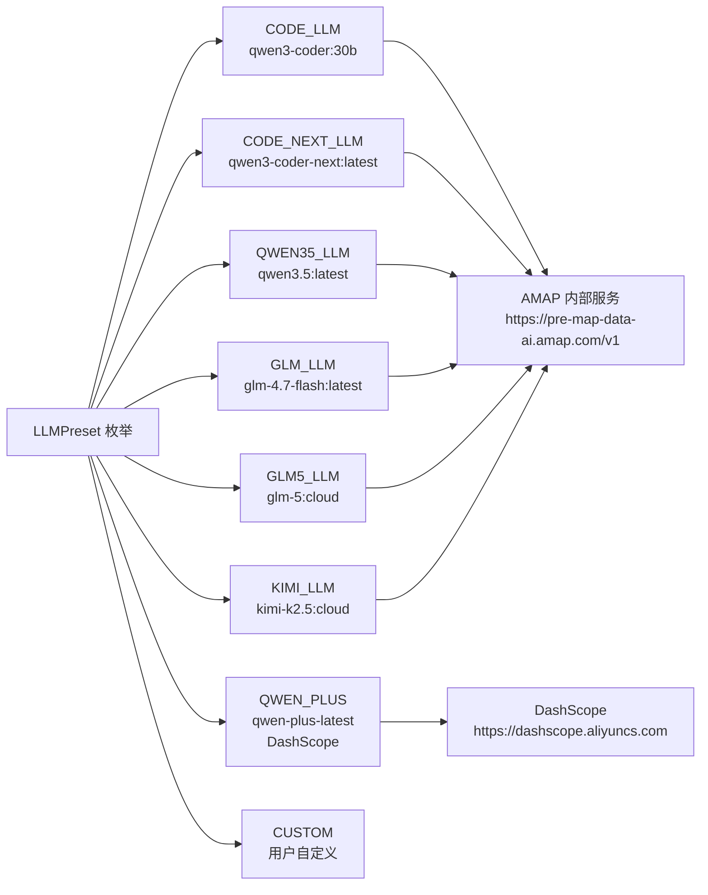

### LLM 创建优先级

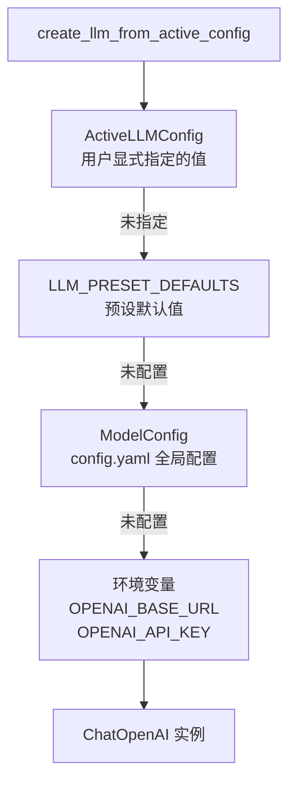

### 模型切换流程

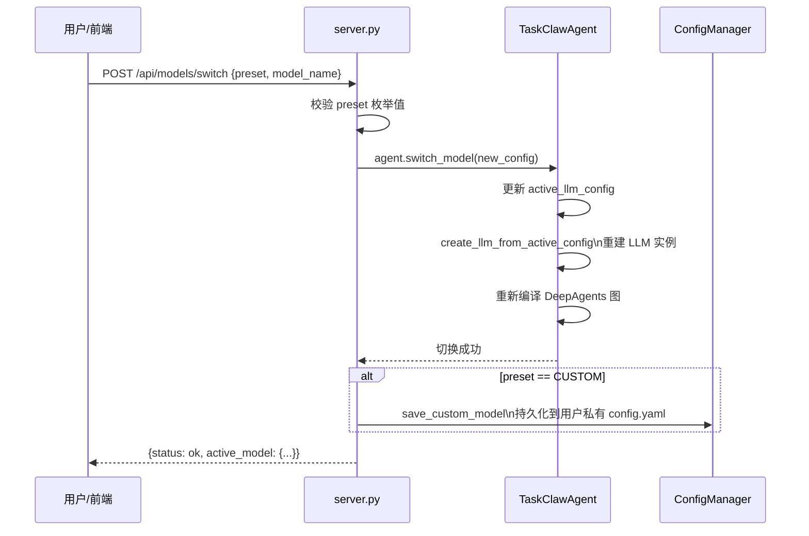

---

## 10. 用户数据隔离设计

### 目录结构

```
app/backend-aone/
├── config.yaml                    # 全局配置（模板）
├── skills/                        # 全局默认技能（模板）
└── user-data/
    ├── .registry/
    │   └── task_table.json        # 全局调度任务注册表
    └── {user_id}/
        ├── config.yaml            # 用户私有配置（覆盖全局）
        ├── skills/                # 用户私有技能
        │   ├── skill-a/
        │   └── skill-b/
        ├── .db/
        │   └── sessions.db        # 用户会话 + Checkpoint SQLite
        ├── memory/                # 用户长期记忆
        ├── schedule.md            # 用户定时任务定义
        └── sessions/              # 用户任务产出文件
```

### 多用户隔离模型

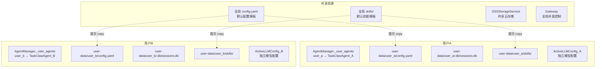

---

## 11. 核心请求流程

### 完整 SSE 任务请求链路

```mermaid
sequenceDiagram
    participant U as 前端用户
    participant API as FastAPI server.py
    participant GM as AgentManager
    participant GW as Gateway
    participant AG as TaskClawAgent
    participant MW as Middleware 链
    participant DA as DeepAgents
    participant MCP as MCP 工具
    participant OSS as OSS 存储

    U->>API: POST /api/task?task_content=xxx&user_id=yyy
    API->>API: 参数校验
    API->>GM: get_or_create_agent(user_id)
    GM-->>API: TaskClawAgent 实例
    API->>GM: create_session(user_id)
    GM-->>API: session_id
    API-->>U: SSE: metadata {session_id}

    API->>GW: handle_task(stream_handler)
    GW->>GW: 并发检查（全局 + 用户级）
    GW->>AG: stream_with_state(message, thread_id)

    AG->>MW: UserDataMiddleware.before()
    MW->>MW: MemoryMiddleware.before()\n加载历史记忆注入 Prompt
    MW->>DA: astream_events(input, config)

    loop Agent 推理循环
        DA->>DA: LLM 推理（ChatOpenAI）
        DA-->>AG: token 事件
        AG-->>API: yield SSE token
        API-->>U: SSE: data token

        opt 需要工具调用
            DA->>MCP: 调用 MCP 工具
            MCP-->>DA: 工具结果
            DA-->>AG: tool_start / tool_end 事件
            AG-->>API: yield SSE tool 事件
            API-->>U: SSE: data tool_start/end
        end

        opt 需要澄清
            DA->>AG: ask_clarify 事件
            AG-->>U: SSE: ask_clarify {question}
            Note over U,AG: 任务暂停
            U->>API: POST /api/task?resume_answer=xxx
            API->>AG: resume_with_state(answer)
        end
    end

    DA-->>AG: 推理完成
    MW->>MW: MemoryMiddleware.after()\n更新长期记忆
    AG-->>API: yield on_chain_end
    API-->>U: SSE: on_chain_end
    API-->>U: SSE: [DONE]

    opt OSS 已配置
        AG->>OSS: 同步任务产出文件
    end
```

---

## 附录：技术栈

| 层次 | 技术选型 |
|------|----------|
| Web 框架 | FastAPI + Uvicorn |
| Agent 推理框架 | DeepAgents (基于 LangGraph) |
| LLM 接入 | LangChain OpenAI (`ChatOpenAI`) |
| 数据校验 | Pydantic v2 |
| 会话持久化 | SQLite (AsyncSqliteSaver) |
| 外部工具协议 | MCP (stdio / http / streamable-http) |
| 云存储 | 阿里云 OSS |
| 沙箱执行 | E2B / Daytona / Local |
| 流式传输 | SSE (Server-Sent Events) |
| 配置管理 | YAML + 环境变量 (`${VAR}` 语法) |
| 前端 | React + Ant Design X |
