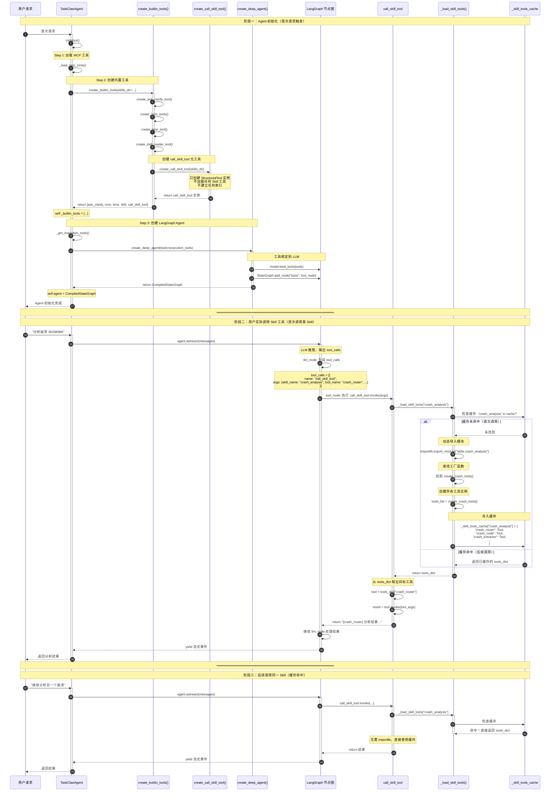

## 关键时间点总结

| 时间点 | 发生什么 | 位置 |
|-------|---------|------|
| **Agent 初始化时** | `call_skill_tool` 元工具被创建并加入 `builtin_tools` | `create_builtin_tools()` |
| **Agent 初始化时** | `call_skill_tool` 被绑定到 LLM (`bind_tools`) | `create_deep_agent()` |
| **Agent 初始化时** | **不建立任何 Skill 索引**，`_skill_tools_cache = {}` 为空 | - |
| **首次调用某 Skill 时** | `importlib.import_module()` 动态导入 Skill 模块 | `_load_skill_tools()` |
| **首次调用某 Skill 时** | 调用 `create_xxx_tools()` 创建所有工具实例 | `_load_skill_tools()` |
| **首次调用某 Skill 时** | 存入 `_skill_tools_cache` 缓存 | `_load_skill_tools()` |
| **后续调用同一 Skill** | 直接从缓存取，无任何导入操作 | `_load_skill_tools()` |

## 结论

```
Agent 初始化时：
┌─────────────────────────────────────┐
│ builtin_tools = [                   │
│   ask_clarify,                      │
│   cron_xxx,                         │
│   time,                             │
│   skill,                            │
│   call_skill_tool  ← 只有这个壳子    │
│ ]                                   │
├─────────────────────────────────────┤
│ _skill_tools_cache = {}  ← 完全空的 │
└─────────────────────────────────────┘

首次调用 crash_analysis 后：
┌─────────────────────────────────────┐
│ _skill_tools_cache = {              │
│   "crash_analysis": {               │
│     "crash_router": <Tool>,         │
│     "crash_code": <Tool>,           │
│     "crash_extractor": <Tool>,      │
│     ...                             │
│   }                                 │
│ }                                   │
└─────────────────────────────────────┘
```

**答案**：Agent 初始化时**完全没有索引**，`_skill_tools_cache` 是空的。只有在**首次调用某个 Skill 时**才会动态导入并缓存该 Skill 的所有工具。