## 分析总结

通过对代码的深入研究，我梳理出了两个核心场景的完整交互链路：

---

### 场景一：初始加载（页面首次打开）

页面加载时，前端会并行发起多个请求：

1. **`app.ts` → `getInitialState()`** → `GET /api/user/current` → MidwayJS 从 BUC 认证上下文读取用户信息（workid、name、avatar）
2. **`Chat/index.tsx` → `useEffect`** → `GET /api/departments` → MidwayJS 代理 → Python FastAPI → 数据库查询部门列表
3. **`Chat/index.tsx` → `useEffect`** → `GET /api/task/mode?user_id=xxx` → 获取任务模式（fast/plan）
4. **`Chat/index.tsx` → `useEffect`** → `GET /api/web-search/status?user_id=xxx` → 获取联网搜索开关状态
5. **`useSkillSelector` → `useEffect`** → 并行请求 `GET /api/skills/list?user_id=global` + `GET /api/skills/list?user_id=xxx` → 获取全局技能 + 用户私有技能
6. **`useChat` → `useEffect`** → 心跳 `POST /api/frontend/ping` 每 10 秒一次
7. **`useChat` → `loadMessagesForConversation()`** → 从 `localStorage` 恢复上次会话消息（纯前端，无后端请求）

### 场景二：点击"新对话"

点击侧边栏菜单 `/chat` 时（`app.ts` 的 `menuItemRender`），如果已在 `/chat` 页面，会 `history.push('/chat?new=' + Date.now())`，触发 URL 变化：

1. **`useChat` → `useEffect` 监听 `location.search`** → 检测到 `new` 参数变化
2. **纯前端操作**：保存当前消息到 `localStorage` → `clearQuery()` 清空查询状态 → 重置 `lastSessionIdRef` → 清空消息列表和输入框
3. **不会立即创建 session** — session 是在用户发送第一条消息时才通过 `POST /api/session?user_id=xxx&agent_type=xxx` 创建的（懒创建模式）

---

下面是完整的 Mermaid 时序图：

```mermaid
sequenceDiagram
    participant User as 👤 用户
    participant Browser as 🌐 浏览器(React)
    participant LocalStorage as 💾 localStorage
    participant Midway as 🔧 MidwayJS<br/>(Node.js 代理层)
    participant Python as 🐍 Python FastAPI<br/>(Agent 后端)
    participant DB as 🗄️ 数据库

    %% ==================== 场景一：初始加载 ====================
    rect rgb(230, 245, 255)
    Note over User, DB: 📌 场景一：页面初始加载

    User->>Browser: 访问 /chat 页面

    %% 1. 获取用户信息（app.ts getInitialState）
    Browser->>Midway: GET /api/user/current
    Midway->>Midway: 从 BUC 认证上下文<br/>读取 ctx.user
    Midway-->>Browser: { workid, name, avatar }

    %% 2. 从 localStorage 恢复消息
    Browser->>LocalStorage: loadMessagesForConversation(key)
    LocalStorage-->>Browser: 历史消息数组 (或空数组)

    %% 3-7 并行请求
    par 并行初始化请求
        %% 3. 获取部门列表
        Browser->>Midway: GET /api/departments
        Midway->>Python: GET /api/departments
        Python->>DB: 查询部门列表
        DB-->>Python: 部门数据
        Python-->>Midway: { departments: [...] }
        Midway-->>Browser: 部门列表

    and 获取任务模式
        Browser->>Midway: GET /api/task/mode?user_id=xxx
        Midway->>Python: GET /api/task/mode?user_id=xxx
        Python->>DB: 查询用户任务模式配置
        DB-->>Python: mode: fast/plan
        Python-->>Midway: { user_id, mode }
        Midway-->>Browser: 任务模式

    and 获取联网搜索状态
        Browser->>Midway: GET /api/web-search/status?user_id=xxx
        Midway->>Python: GET /api/web-search/status?user_id=xxx
        Python->>DB: 查询联网搜索开关
        DB-->>Python: enabled: true/false
        Python-->>Midway: { code:0, content:{enabled} }
        Midway-->>Browser: 联网搜索状态

    and 加载技能列表
        Browser->>Midway: GET /api/skills/list?user_id=global
        Midway->>Python: GET /api/skills/list?user_id=global
        Python->>DB: 查询全局技能
        DB-->>Python: 全局技能列表
        Python-->>Midway: 全局技能
        Midway-->>Browser: 全局技能列表

        Browser->>Midway: GET /api/skills/list?user_id=xxx
        Midway->>Python: GET /api/skills/list?user_id=xxx
        Python->>DB: 查询用户私有技能
        DB-->>Python: 用户技能列表
        Python-->>Midway: 用户技能
        Midway-->>Browser: 用户技能列表

    and 前端心跳启动
        Browser->>Midway: POST /api/frontend/ping<br/>{user_id, has_active_sse:false}
        Note over Browser: 每10秒重复发送
    end

    Browser->>Browser: 合并技能列表(去重)<br/>渲染欢迎页面
    end

    %% ==================== 场景二：点击"新对话" ====================
    rect rgb(255, 245, 230)
    Note over User, DB: 📌 场景二：点击"新对话"

    User->>Browser: 点击侧边栏"新对话"<br/>(或菜单中的 /chat)

    Browser->>Browser: app.ts menuItemRender<br/>history.push('/chat?new=' + Date.now())

    Note over Browser: useChat useEffect<br/>检测到 URL new 参数变化

    Browser->>LocalStorage: saveMessagesForConversation<br/>(保存当前会话消息)
    LocalStorage-->>Browser: 保存成功

    Browser->>Browser: clearQuery() 清空查询状态
    Browser->>Browser: lastSessionIdRef = ''<br/>(重置 session_id)
    Browser->>Browser: setMessages([])<br/>setInputValue('')<br/>setUploadedFiles([])

    Note over Browser, DB: ⚠️ 此时不会创建新 session<br/>Session 采用懒创建模式<br/>等用户发送第一条消息时才创建
    end

    %% ==================== 补充：首次发送消息时创建 Session ====================
    rect rgb(240, 255, 240)
    Note over User, DB: 📌 补充：用户发送第一条消息（触发 Session 创建）

    User->>Browser: 输入消息并发送

    Browser->>Browser: handleSubmit()<br/>乐观UI: 立即追加 user + assistant 气泡<br/>清空输入框

    Browser->>Midway: POST /api/session?user_id=xxx&agent_type=taskclaw
    Midway->>Python: POST /api/session?user_id=xxx&agent_type=taskclaw
    Python->>DB: INSERT 新会话记录<br/>(session_id, user_id, agent_type, status)
    DB-->>Python: 新 session_id
    Python-->>Midway: session_id
    Midway-->>Browser: session_id

    Browser->>Browser: lastSessionIdRef = session_id<br/>自动命名会话(取前20字符)

    Browser->>Midway: POST /api/task (SSE 流)<br/>{task_content, user_id, session_id, agent_type, mode}
    Midway->>Python: POST /api/task (SSE 透传)
    Python->>DB: 创建 turn 记录
    DB-->>Python: turn_id

    loop SSE 流式响应
        Python-->>Midway: SSE event (on_chat_model_stream / on_tool_start / on_tool_end / ...)
        Midway-->>Browser: SSE event 透传
        Browser->>Browser: 实时更新 assistant 气泡内容
    end

    Python->>DB: 更新 turn 记录<br/>(assistant_reply, status=done)
    Python-->>Midway: SSE 流结束
    Midway-->>Browser: 流结束

    Browser->>LocalStorage: saveMessagesForConversation<br/>(持久化完整对话)
    end
```

---

### 关键发现总结

| 维度 | 初始加载 | 点击"新对话" |
|------|---------|-------------|
| **用户认证** | `GET /api/user/current` 从 BUC 获取 workid | 不触发（已有用户信息） |
| **后端请求数** | **6-7 个**并行请求 | **0 个**后端请求 |
| **数据库交互** | 查询部门、任务模式、联网状态、技能列表 | 无数据库交互 |
| **Session 创建** | 不创建 | 不创建（懒创建） |
| **localStorage** | 读取历史消息 | 保存当前 → 清空 |
| **核心设计** | 并行初始化，快速渲染 | 纯前端状态重置，零网络开销 |

**最值得注意的设计**：Session 采用**懒创建模式** — 无论是初始加载还是新对话，都不会立即创建 session，只有在用户真正发送第一条消息时，才会 `POST /api/session` 创建会话，然后紧接着 `POST /api/task` 发起 SSE 流式查询。这样避免了用户打开页面但不发消息时的无效 session 创建。

需要我进一步分析某个具体环节的细节吗？ 😊